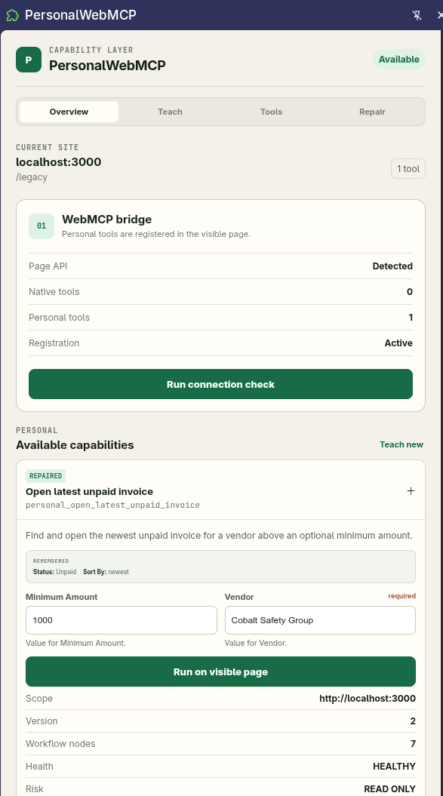

# PersonalWebMCP

**A Chromium extension that lets users create their own WebMCP tools on the websites they use.**

[Companion demo](https://personal-webmcp.mutaician.chatgpt.site) · [Manual verification](docs/MANUAL_TESTS.md) · [MIT license](LICENSE)



WebMCP lets websites define capabilities for agents. PersonalWebMCP adds the user-owned layer: teach a missing workflow once, turn it into a reusable WebMCP tool, combine it with tools the website already exposes, and keep it useful as the interface evolves.

The **extension is the product**. The included websites are controlled companion demos for proving the extension against three different conditions: a legacy site with no tools, a modern site with native tools but a missing action, and a hybrid travel workflow.

## What the extension adds to WebMCP

After the user enables a website, PersonalWebMCP registers extension-owned capabilities into that page's `document.modelContext`. An agent sees them in the same tool catalog as website-owned tools.

| Tool type | What the agent receives |
| --- | --- |
| `personal_ping` | A built-in extension tool that verifies registration and execution on the visible page |
| Taught `personal_*` tool | A missing browser workflow compiled into a named tool with JSON Schema inputs |
| Composite `personal_*` tool | One higher-level capability that can call native site tools and taught personal actions |
| Repaired personal tool | The same public contract, updated to match an evolved interface |

Except for `personal_ping`, the extension intentionally does not ship a fixed catalog of business actions. Its purpose is to **make tools**: each saved personal capability is dynamically registered through WebMCP and can be invoked by a compatible agent.

For example, a user can:

1. Teach an invoice search to a portal that exposes no WebMCP tools.
2. Choose `vendor` and `min_amount` as agent inputs while remembering status and sort preferences.
3. Save `personal_open_latest_unpaid_invoice`.
4. Ask an agent to open the newest unpaid Acme invoice above $5,000.

On a site that already exposes tools, the user can instead adapt and extend them. The Forma demo exposes five configurator tools but no **Add to project** tool. PersonalWebMCP can teach that missing action and compose it with the five native tools as one personalized capability such as `personal_prepare_my_studio_workspace`.

## How it works

```text
User demonstrates or composes a capability in the extension
                              |
                              v
            PersonalWebMCP creates a typed contract
                              |
                              v
 Extension MAIN-world bridge registers it on the visible page
                              |
                              v
 document.modelContext lists native + personal tools together
                              |
                              v
 Agent invokes the personal tool with structured JSON input
                              |
                              v
 Extension executes, verifies, reports, and can repair the workflow
```

WebMCP is page-scoped: `document.modelContext` belongs to the visible webpage, not to an extension service worker. PersonalWebMCP therefore injects a small MAIN-world bridge into each user-enabled page. The side panel, isolated content script, service worker, and page bridge communicate without replacing the standard WebMCP tool surface.

The extension's registration helper uses the real API:

```ts
await modelContext.registerTool({
  name: registration.name,
  title: registration.title,
  description: registration.description,
  inputSchema: registration.inputSchema,
  annotations: registration.annotations,
  execute: async (input, options) => {
    options?.signal?.throwIfAborted();
    return agentSafeResult(
      await execute(normalizeInvocationInput(input), options?.signal),
    );
  },
}, { signal });
```

It also discovers native tools with `document.modelContext.getTools()` and invokes composite dependencies through `document.modelContext.executeTool()`. See [the WebMCP helpers](packages/webmcp/src/index.ts) and [page runtime](apps/extension/entrypoints/webmcp-main.ts).

## Extension capabilities

- **Enable per origin:** the user explicitly grants access to each HTTP(S) site.
- **Inspect and run:** list the visible page's native and personal tools with schema-driven inputs.
- **Teach:** record a permitted visible workflow, then decide which values stay fixed and which become agent inputs.
- **Compile:** create the tool name, description, JSON Schema, executable workflow graph, scope, risk and provenance together.
- **Compose:** combine native site tools and personal tools into one higher-level WebMCP capability.
- **Execute visibly:** restore the tool's starting context, act on the current page and return an agent-readable result.
- **Repair:** use semantic evidence to adapt changed targets, with approval when the replacement is ambiguous.
- **Keep control:** store definitions locally, redact sensitive controls and require confirmation for consequential workflows.

## Install the extension

Requirements:

- Node.js 24 or newer
- pnpm 11 or newer
- a WebMCP-capable Chrome/Chromium build with WebMCP testing enabled

Build it:

```bash
git clone https://github.com/mutaician/PersonalWebMCP.git
cd PersonalWebMCP
pnpm install
pnpm build
```

Load it in Chrome:

1. Open `chrome://flags/#enable-webmcp-testing`, enable WebMCP testing, and restart Chrome.
2. Open `chrome://extensions` and enable **Developer mode**.
3. Select **Load unpacked** and choose `apps/extension/.output/chrome-mv3`.
4. Open a website, open the PersonalWebMCP side panel, and grant access to the displayed origin.
5. Select **Run connection check**. Success appears in the side panel and proves that the extension's `personal_ping` tool executed through WebMCP.

The extension follows the active browser tab. Each origin is detected and scoped independently; tools from one site are not offered as executable capabilities on an unrelated site.

## Verify it with an agent

Chrome's [Model Context Tool Inspector](https://chromewebstore.google.com/detail/webmcp-model-context-tool/gbpdfapgefenggkahomfgkhfehlcenpd) can discover and invoke the native and personal tools registered on the visible page. Its natural-language agent mode optionally uses a Gemini API key.

Use the [live companion demo](https://personal-webmcp.mutaician.chatgpt.site) for two concise proof paths:

- **Legacy portal:** teach `personal_open_latest_unpaid_invoice` where the website provides zero native tools, then have the agent invoke it with a different vendor and amount.
- **Forma configurator:** inspect and run the five native `configurator_*` tools, teach the missing **Add to project** action, then compose both into one agent-callable personal tool.

The exact setup, inputs, expected visible outcomes, repair checks and clean-profile release check are in [docs/MANUAL_TESTS.md](docs/MANUAL_TESTS.md).

## Architecture

```text
WebMCP agent / Inspector
          |
 document.modelContext  <----- website-owned native tools
          |
 extension MAIN-world bridge
          |
 isolated content script
          |
 service worker -------- local extension storage
          |
 compiler + executor + semantic repair
          |
 side panel: inspect · teach · compose · run · repair
```

- [apps/extension](apps/extension) — the PersonalWebMCP product: Manifest V3 runtime and side panel.
- [packages/webmcp](packages/webmcp) — WebMCP registration, discovery and invocation helpers.
- [packages/engine](packages/engine) — intent compiler and workflow graph primitives.
- [packages/contracts](packages/contracts) — typed tool records and bridge messages.
- [apps/demo](apps/demo) — public companion fixtures used to demonstrate and evaluate the extension.

## Develop locally

Run the demo and extension development builds:

```bash
pnpm dev
```

The demo runs at `http://localhost:3000`; load `apps/extension/.output/chrome-mv3` as the unpacked extension. After extension code changes, reload the extension and the tested page.

Minimal project checks:

```bash
pnpm typecheck
pnpm build
pnpm zip:extension
```

The packaged Chromium extension is written to `apps/extension/.output/`. No private backend, login, paid API or hidden dataset is required.

## Current scope

This version targets WebMCP-enabled Chromium and executes against the visible, user-enabled page. Personal capabilities, receipts and repair history remain in extension storage. The longer-term direction is to make the same user-owned capability contracts available to other WebMCP-compatible agents without tying them to one agent provider.

## License

PersonalWebMCP is open source under the [MIT License](LICENSE).
