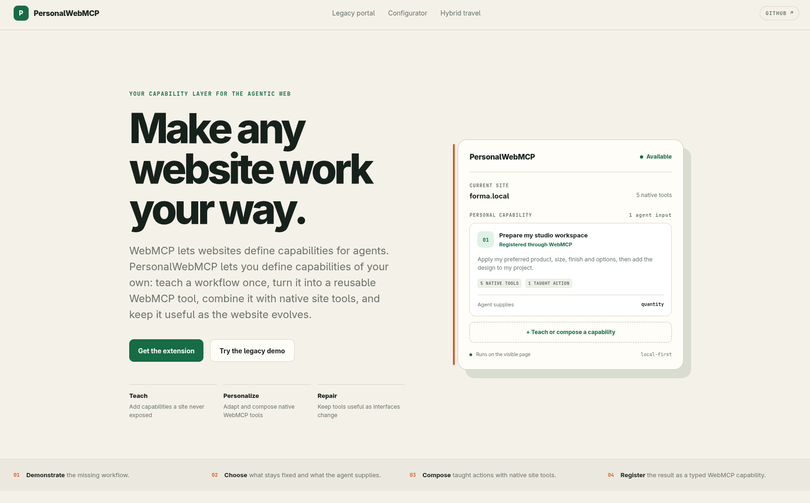

# PersonalWebMCP

**Define your own capabilities for the web.**

[Live demo](https://personal-webmcp.mutaician.chatgpt.site) · [Manual verification](docs/MANUAL_TESTS.md) · [MIT license](LICENSE)



WebMCP lets websites define typed capabilities for agents. PersonalWebMCP adds the user-owned layer: teach a missing workflow once, decide what remains a preference and what an agent may supply, compose it with tools the website already exposes, and keep the capability useful as the interface evolves.

PersonalWebMCP is a Chromium extension paired with a public WebMCP demo site. The extension can be enabled one origin at a time, so the same user-owned capability model is not limited to the included demos.

## What PersonalWebMCP does

- **Teach:** record a visible browser workflow and compile its intent into a named, typed WebMCP tool.
- **Personalize:** remember fixed preferences while turning selected values into JSON Schema inputs for the agent.
- **Compose:** combine website-owned WebMCP tools, other personal tools, and taught missing actions into a higher-level capability.
- **Repair:** match changed controls using semantic evidence, verify the visible outcome, and retain versioned repair history.
- **Keep control:** store definitions locally, scope tools by origin and path, redact sensitive inputs, and pause consequential workflows for human confirmation.

The result is not a prompt library. Personal capabilities are registered with `document.modelContext`, discovered alongside website-owned tools, and invoked through WebMCP.

## How WebMCP is used

PersonalWebMCP exercises the WebMCP lifecycle in three ways.

### 1. Websites register native tools

The Forma and Wayfinder demos expose typed website-owned capabilities. A simplified example from the configurator is:

```ts
const controller = new AbortController();

await document.modelContext.registerTool({
  name: 'configurator_set_quantity',
  title: 'Set project quantity',
  description: 'Changes the visible project quantity and total.',
  inputSchema: {
    type: 'object',
    properties: {
      quantity: { type: 'integer', minimum: 1, maximum: 8 },
    },
    required: ['quantity'],
    additionalProperties: false,
  },
  annotations: {
    readOnlyHint: false,
    untrustedContentHint: false,
  },
  execute: async (input, options) => {
    options?.signal?.throwIfAborted();
    setQuantity(input.quantity);
    return { ok: true, quantity: input.quantity };
  },
}, { signal: controller.signal });
```

See the complete native registrations in [the configurator hook](apps/demo/app/configurator/use-configurator-webmcp.ts) and [travel hook](apps/demo/app/travel/use-travel-webmcp.ts).

### 2. The extension registers personal tools

The extension injects a small MAIN-world bridge because `document.modelContext` belongs to the page context. Compiled personal contracts are passed to that bridge and registered dynamically:

```ts
await modelContext.registerTool({
  name: registration.name,
  title: registration.title,
  description: registration.description,
  inputSchema: registration.inputSchema,
  annotations: registration.annotations,
  execute: async (input, options) => {
    options?.signal?.throwIfAborted();
    return executePersonalCapability(input, options?.signal);
  },
}, { signal });
```

The real implementation is in [packages/webmcp](packages/webmcp/src/index.ts) and the [MAIN-world runtime](apps/extension/entrypoints/webmcp-main.ts). Abort signals control registration lifetime and invocation cancellation.

### 3. Personal composites invoke native tools

The extension discovers tools with `document.modelContext.getTools()` and invokes dependencies with `document.modelContext.executeTool()`. A composite therefore remains a WebMCP tool itself while orchestrating capabilities already provided by the visible site.

For example, `personal_prepare_my_studio_workspace` can remember a product, size, finish and options, expose only `quantity` to the agent, invoke five native configurator tools, then call a user-taught **Add to project** capability.

## Tool model

| Tool kind | Created by | Purpose |
| --- | --- | --- |
| Native | Website | Fine-grained capabilities registered directly by the current page |
| Taught | User | A missing visible workflow compiled into a typed personal tool |
| Composite | User | A higher-level capability built from native and/or personal tools |
| System | Extension | Connection and runtime checks such as `personal_ping` |

Every saved personal tool carries:

- a WebMCP-safe name, title and description;
- a JSON Schema input contract;
- origin, path and prerequisite scope;
- read-only/untrusted-content annotations and a risk class;
- an executable workflow graph;
- provenance, health, versions and repair history.

## Controlled demos

The public site uses fictional deterministic data and reset controls.

### Atlas Supplier Portal — teach

A deliberately old interface with no native tools. Teach the invoice search once, expose `vendor` and `min_amount` as inputs, and let an agent invoke `personal_open_latest_unpaid_invoice` from another portal section.

### Forma Configurator — personalize and compose

A modern site with five native WebMCP tools. Adapt them into a preferred workspace, teach the missing **Add to project** action, and combine both into one personal capability.

### Wayfinder Travel — hybrid and review

Native trip search/detail tools can be combined with a learned personal preference and an explicit human checkpoint before a consequential action continues.

## Architecture

```text
WebMCP agent / Model Context Tool Inspector
                    |
                    v
           document.modelContext
            /              \
 website-owned tools   page MAIN-world bridge
                              |
                    isolated content script
                              |
                    extension service worker
                   /          |           \
          local storage   intent compiler   executor + repair
                              |
                          side panel
                teach · compose · run · review
```

- The **side panel** is the user interface for permissions, teaching, contracts, composition, execution and repair.
- The **content script** records permitted visible interactions and carries messages across the isolated-world boundary.
- The **service worker** owns persistence, scope, orchestration, receipts and confirmation state.
- The **MAIN-world bridge** is the only extension component that touches the page's WebMCP API.
- The **compiler** normalizes raw interactions into task-level workflow nodes and generates the schema and executable graph together.

## Install the extension

### Requirements

- Node.js 24 or newer
- pnpm 11 or newer
- Google Chrome 149 or later with WebMCP testing enabled

### Build and load

```bash
git clone https://github.com/mutaician/PersonalWebMCP.git
cd PersonalWebMCP
pnpm install
pnpm build
```

1. Open `chrome://flags/#enable-webmcp-testing`.
2. Enable WebMCP testing and restart Chrome completely.
3. Open `chrome://extensions` and enable **Developer mode**.
4. Select **Load unpacked**.
5. Choose `apps/extension/.output/chrome-mv3`.
6. Open the [live demo](https://personal-webmcp.mutaician.chatgpt.site).
7. Open PersonalWebMCP and grant access to the displayed origin.
8. Run **Connection check**. The result appears directly in the side panel.

Site access is optional and origin-specific. The extension requests broader HTTP(S) access only when the user explicitly enables another site.

## Test with an agent

Install Chrome's [Model Context Tool Inspector](https://chromewebstore.google.com/detail/webmcp-model-context-tool/gbpdfapgefenggkahomfgkhfehlcenpd). Its agent mode can discover and invoke the same native and personal tools registered on the visible page.

A short evaluation path:

1. Confirm `personal_ping` succeeds in the extension.
2. Open `/configurator` and confirm five native `configurator_*` tools are discovered.
3. Run one native tool and confirm the visible design changes.
4. Open `/legacy`, teach the invoice workflow, and save it as a personal tool.
5. Ask the Inspector agent: **“Open the newest unpaid invoice from Acme Industrial Supply above $5,000.”**
6. Confirm it invokes the personal tool with structured arguments and opens `INV-2041`.

The complete reproducible journeys, expected results, repair checks and clean-profile release test are in [docs/MANUAL_TESTS.md](docs/MANUAL_TESTS.md).

## Run locally

Start both the demo and extension development builds:

```bash
pnpm dev
```

The demo is served at `http://localhost:3000`. Load the development extension from `apps/extension/.output/chrome-mv3`.

Minimal release checks:

```bash
pnpm typecheck
pnpm build
pnpm zip:extension
```

The packaged Chromium extension is written to `apps/extension/.output/`.

## Repository map

```text
apps/demo                 public landing page and controlled WebMCP demos
apps/extension            WXT Manifest V3 extension and side panel
packages/contracts        typed bridge messages, tool records and schemas
packages/engine           intent compiler and workflow graph primitives
packages/webmcp           WebMCP discovery, registration and invocation helpers
docs/MANUAL_TESTS.md      public browser and agent verification guide
```

All functionality required for the demo is contained in this repository. No private backend, login, paid API or hidden dataset is required. A Gemini API key is optional only when using the third-party Inspector's natural-language agent mode.

## Trust boundaries

- Personal capabilities and receipts are stored locally in extension storage.
- Registration is filtered by origin, path, health and native prerequisites.
- Password, OTP, card, token and secret-like controls are excluded from durable recordings.
- Invalid schemas and missing targets stop before execution.
- Ambiguous repairs require approval or guided selection.
- Consequential composites can require an explicit human decision.

## Current scope

This submission targets WebMCP-enabled Chrome. Because personal capabilities are registered through the standard page API, the longer-term direction is to surface the same user-owned tool contracts to other WebMCP-compatible agents, including desktop agent clients.

## License

PersonalWebMCP is open source under the [MIT License](LICENSE).
